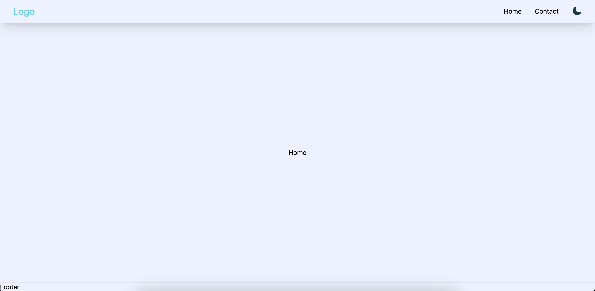
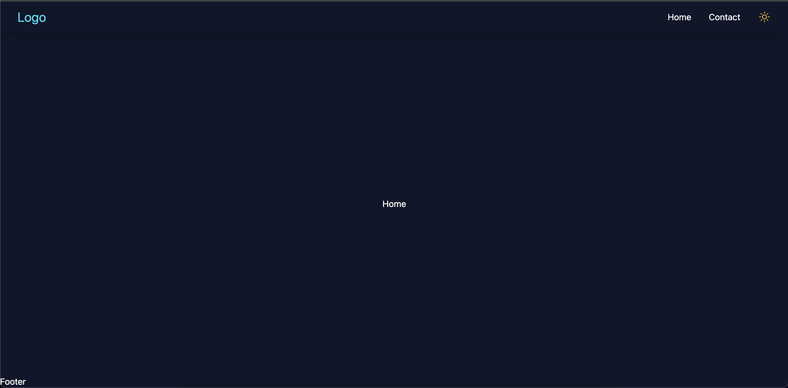

# Project Description and Goals

The base-react-tailwind-dark project is a React-based web application that provides a base template for building web applications with a dark-themed Tailwind CSS design. The goal of this project is to provide a foundation for developers to quickly create and deploy their own web applications with minimal setup required. The project includes a pre-configured development environment, optimized for ease of use and flexibility.

# Installation and Running

To run this project, follow these steps:

1. Clone this repository to your local machine using the command `git clone https://github.com/username/base-react-tailwind-dark.git`
2. Change into the project directory with `cd base-react-tailwind-dark`
3. Install the required dependencies with `npm install`
4. Start the development server with `npm start`
5. Open your browser and navigate to `http://localhost:3000`

Light Mode

Dark Mode

# Latest Changes

The latest changes made to the codebase include:

- Improved the performance of the application by reducing the size of the bundle
- Updated the project dependencies to their latest versions

# Contribution Guidelines

We welcome contributions to this project! To get started, please follow these guidelines:

1. Fork the repository and create a new branch for your changes
2. Make your changes and test them thoroughly
3. Submit a pull request to the main repository with a clear description of your changes

# Contact Information

If you have any questions or concerns about this project, please contact the project maintainers at `https://github.com/dcryptoniun`.